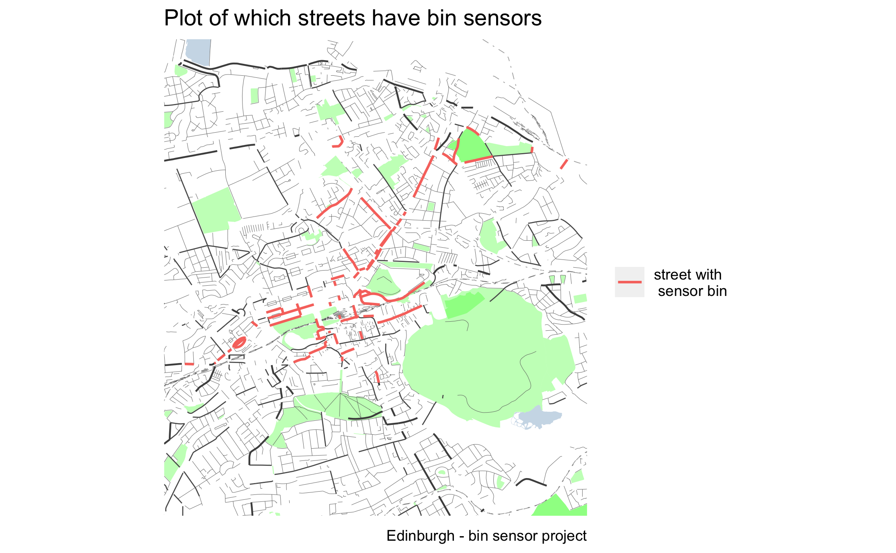
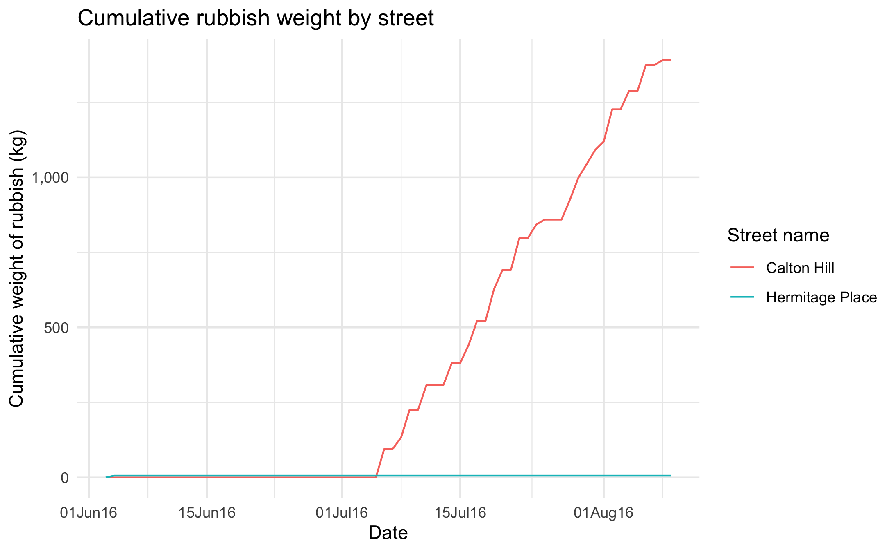

README
================

## Overview

Photo by
<a href="https://unsplash.com/@peter_cordes?utm_source=unsplash&utm_medium=referral&utm_content=creditCopyText">Peter
Cordes</a> on
<a href="https://unsplash.com/?utm_source=unsplash&utm_medium=referral&utm_content=creditCopyText">Unsplash</a>

This is a project using data from a bin sensor project in Edinburgh when
public rubbish bins had sensors fitted so that bin lorry crews know when
they are full. A total of 323 litter bins in the city centre, Leith
Walk, Leith Links and Portobello Promenade were fitted with the sensors.
More can be found about the project
[here](https://www.heraldscotland.com/news/14745124.edinburgh-litter-bins-fitted-sensors-bin-lorry-crews-know-need-emptied/).
The data covers the period 3rd June 2016 to 9th August 2016.

Data is from Edinburgh Council Open Data Portal:
<https://data.edinburghopendata.info/dataset/litter-bin-sensor-data>
(available under the Open Government License v3.0).

Project aims:

  - Learning about OpenStreetMap data via the use of `osmdata` package
    [page](https://github.com/ropensci/osmdata)
  - Explore how the volume/weight of rubbish changes over the time
    period.
  - Explore how the volume/weight of rubbish compares between bin
    locations.
  - Create small interactive plots for users to explore data.

Attribution: The learning/code using the OpenStreetMap data come from
this [blog](https://taraskaduk.com/posts/2021-01-18-print-street-maps/)
(Reference: Kaduk (2021, Jan. 18). Taras Kaduk: Print Personalized
Street Maps Using R).

## Cleaning

The scripts to clean and tidy the bin data and OSM data and join these
together as in the folder [cleaning\_scripts](./cleaning_scripts). The
cleaned data is then saved in the folder
[cleaned\_data](./cleaned_data).

Notes on some of the decisions made during the cleaning process:

  - Decided to concentrate on Edinburgh City Centre so did not include
    locations in Portobello.
  - Gayfield Square Park, Leith Links, Princes Street Gardens East,
    Princes Street Gardens West are all parks so decide to remove from
    analysis as found visualising volume via thickness of line of street
    did not work well for parks (since these are filled polygons).
  - Restalrig railway path is a cycleway on OpenStreetMap so choose to
    also remove.

## Analysis & visualisation

There are 2 pieces of work for analysing & visualising the data (which
are still works in process) saved in the [output folder](./output):

  - Markdown report
    [here](output/analysis_report/total_rubbish_spatial_analysis.html)
    with some visuals on top and bottom streets in terms of cumulative
    rubbish weight, spatial visualisation of streets in terms of rubbish
    weight and looking at the rate of change of rubbish accumulating on
    particular streets.
  - Shiny app (code [here](output/shiny_app/shiny_apps.html)) where the
    user can select 2 streets and compare the total weight, how the
    weight accumulated over time and where the streets are located
    spatially. The user can select for the graphs to be in kilograms or
    equivalent weight object (as an alternative way of conceptualising
    the weight of the rubbish). The app is also hosted [here]() if don’t
    want to run the code.

### Some output from the report

1.  Looked at top and bottom streets for total rubbish weight
    
    

2.  Put the scales of this into objects to help contextualise the
    weights.

| Object         | Average weight (kg) |
| -------------- | ------------------- |
| Vauxhall Corsa | 980                 |
| Adult elephant | 4,300               |
| UK bus         | 12,000              |
| Fire engine    | 19,500              |
| Humpback whale | 30,000              |

3.  ‘Base’ map highlighting which streets have sensor bins.
    

4.  Spatially visualising streets by the weight of the total rubbish
    collected. A lot of sequential colour palettes begin at very light
    colours which would make it hard to see some of the streets with
    lower levels of rubbish, tested out a few colour schemes. From this
    blog
    (here)\[<https://blog.datawrapper.de/which-color-scale-to-use-in-data-vis/>\]
    by Lisa Charlotte Rost she said on sequential colour schemes *‘Using
    two or even more hues increases the color contrast between segments
    of your gradient, making it easier for readers to distinguish
    between them’*. In future want to give this more of an investigation
    and look into some more palettes (or potentially using a different
    coloured background).

5.  Show that Princes Street is a big outlier. Makes sense as it is the
    main shopping street in Edinburgh and lots of footfall. In future
    look to see if any open footfall data to add to analysis. Look at
    the same plot as above but omitting Princes Street to more clearly
    show differences between the other streets (could potentially have
    also done a transformation).

6. Looked at how the weight of rubbish accumulates over time:

7.  From digging into this and looked at the rate of change (by doing a
    log transformation) picked out 2 streets which had particularly
    different rates of change compared to the others. For Hermitage
    Place there was only a small bit of rubbish on the 2nd day of having
    the sensor (it is a little out of city centre) or the sensor perhaps
    didn’t work after this day. Similarly for Calton Hill perhaps there
    was an issue with the sensor as after the start of July the rate of
    increase increases sharply but there is nothing read before this.

